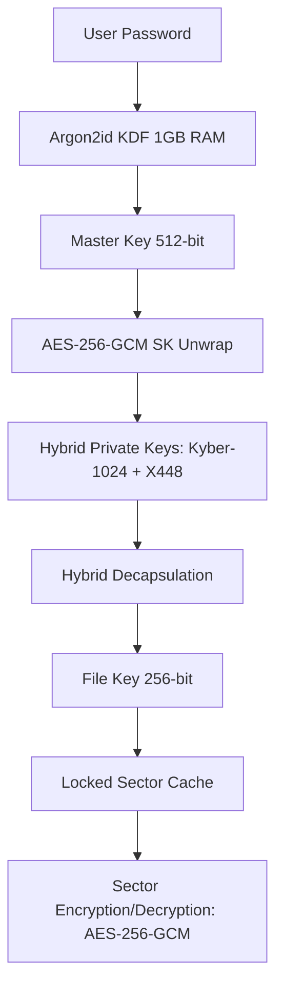

# 🛰️ Axis v11.0.0 (Galactic Edition — CLI)

[](LICENSE)
[](#)
[](#)
[](#)

---

**Axis** is an ultra-secure, high-performance encrypted disk manager engineered for the modern security paradigm. Powered by hardware-accelerated **AES-256-GCM** encryption and a robust hybrid post-quantum key encapsulation mechanism, Axis provides state-of-the-art security margins across all volume layers. By combining cutting-edge lattice-based cryptography, elliptic curve cryptography, and hardware-accelerated CPU instruction sets, it ensures your data remains completely private even against future quantum computing adversaries.

This is the **command-line edition** of Axis — there are no GTK/GUI dependencies. It runs entirely in your terminal, either through a guided interactive menu or via scriptable non-interactive subcommands. It reads and writes the **exact same encrypted container format** as the graphical version, so volumes are fully interchangeable between the two.

---

## 🌌 Key Highlights

*   🛡️ **State-of-the-Art Security Margin**: Full AES-256-GCM authenticated encryption providing cryptographic integrity and confidentiality at the hardware level.
*   🧬 **Hybrid Key Encapsulation (KEM)**: Combines post-quantum **Kyber-1024** (lattice-based) and classical **X448** (elliptic curve Diffie-Hellman) to secure master and file keys.
*   ⚡ **Hardware-Accelerated Engine**: Hand-tuned utilization of AES-NI and AVX2 instruction sets via OpenSSL's EVP framework for lightning-fast disk I/O performance.
*   🌑 **Plausible Deniability**: Full **IND-RND** compliance—volumes have no identifiable headers, signatures, or metadata blocks, rendering them mathematically indistinguishable from raw thermal noise or random data.
*   🔒 **Anti-Brute Force Protection**: Uses **Argon2id** key derivation locked with 1 GB of RAM to render GPU- and ASIC-based brute-force attacks economically and computationally impossible.
*   🔄 **Dual-Generation Compatibility**: Seamless trial-decryption supports legacy and next-generation volume structures.
*   🐧 **FUSE 3 Mounting**: Exposes encrypted containers as transparent, read-write filesystem directories in user space.
*   ⌨️ **Command-Line Interface**: A lightweight, GUI-free interactive menu *and* scriptable subcommands — no GTK, no desktop environment required.

---

## 🛠️ Cryptographic Architecture

Axis employs a multi-tiered cryptographic design to protect files from physical and quantum adversaries:



### Encryption & Decryption Scheme

1.  **Key Wrapping**: Secret keys and KEM parameters are wrapped using **AES-256-GCM** with sector-specific nonces.
2.  **File Stream Layer**: For file operations, Axis divides streams into fixed 4 MB segments. Each segment is processed independently in parallel using a thread-pool (up to 8 hardware threads):
    *   **Encryption**: Conducted via **AES-256-GCM** with unique per-segment derived nonces.
    *   **Decryption**: Performed via **AES-256-CTR** for optimal random-access stream capabilities, with GCM integrity verification checking a final aggregated hash at completion.
3.  **Sector Cache Layer**: Disk sectors are encrypted/decrypted via **AES-256-GCM**, where the sector index is utilized as part of the GCM Initialization Vector (IV) and Additional Authenticated Data (AAD) to prevent sector relocation or replay attacks.

---

## 📋 Prerequisites

To compile and run Axis on Linux, ensure you have the following packages installed:

### Build System & Compilers
- **GCC** (with AVX2 instruction set support and C11/GNU11 standard compatibility)
- **GNU Make**
- **pkg-config**

### Required Libraries
- **libsodium** (Cryptographic primitives)
- **libcrypto** (OpenSSL EVP for hardware-accelerated AES-256-GCM/CTR & X448)
- **libargon2** (Argon2id key derivation)
- **FUSE 3** (`libfuse3-dev` / `fuse3` - Virtual filesystem interface)

> This is the **command-line only** edition — there are no GTK/GUI or ncurses
> dependencies. It runs entirely in your terminal.

### Install Dependencies (Debian/Ubuntu)
```bash
sudo apt update
sudo apt install build-essential pkg-config libsodium-dev libssl-dev libargon2-dev libfuse3-dev
```

---

## ⚙️ Compilation & Installation

### 1. Dependency Validation
Validate that all required tools and libraries are present on your system:
```bash
make check-deps
```

### 2. Compilation
To build the optimized production binary (automatically detects CPU features and utilizes hardware accelerations):
```bash
make
```
This produces the `axis-cli` executable in the build directory.

### 3. Installation
Install the application globally, which copies the `axis-cli` executable to `/usr/local/bin`:
```bash
sudo make install
```

### 4. Uninstallation
To completely remove Axis from the host system:
```bash
sudo make uninstall
```

---

## 🚀 How to Use

Axis CLI works in two complementary ways:

* an **interactive menu** that guides you through every operation, and
* **non-interactive subcommands** for scripting and one-shot tasks.

### Interactive Menu

Run with no arguments to launch the guided menu:

```bash
axis-cli
```

```
========================================
 Axis v11.0.0
========================================
 1. Create a new volume
 2. Open a volume
 3. Mount a volume
 4. Unmount volume
 5. Storage status
 6. Close volume
 7. Exit
----------------------------------------
Select an option [1-7]:
```

Passwords are read without echoing to the terminal. When creating or opening a
volume you are first asked `Show password while typing? [y/N]` — answer `y` to have
characters echoed (handy for long passphrases), or press Enter to keep input hidden.

### Non-Interactive Commands

Every menu action is also available directly from the command line, which is ideal
for scripts and automation:

```
axis-cli create <path> --size <MB> [--password <pw>]
axis-cli mount  <path> <mountpoint> [--password <pw>]
axis-cli info   <path> [--password <pw>]
axis-cli help | --help | -h
axis-cli version | --version | -v
```

If `--password` is omitted, Axis prompts for it securely (without echo). Passing a
password on the command line is convenient for scripting but may expose it to other
users via the process list — prefer the interactive prompt where possible.

#### Examples

**Create a new 256 MB encrypted volume** (you will be prompted for the password):
```bash
axis-cli create secret.axis --size 256
```

**Create a volume non-interactively** (e.g. inside a script):
```bash
axis-cli create secret.axis --size 256 --password 'correct horse battery staple'
```

**Inspect a volume's storage status** (file count and used/free space):
```bash
axis-cli info secret.axis
```
```
Volume:      secret.axis
Files:       2
Total space: 256.00 MB
Used space:  0.01 MB
Free space:  255.99 MB
```

**Mount a volume as a real directory** (the mount point must already exist and be empty):
```bash
mkdir -p ~/vault
axis-cli mount secret.axis ~/vault
```
The command opens the volume, mounts it via FUSE, and **stays in the foreground**.
You can now read, write, copy and modify files under `~/vault` from any program.
Press **Ctrl-C** to unmount, flush all changes to disk, and wipe the keys from memory.

```bash
# in another terminal, while the mount is running:
cp report.pdf ~/vault/
ls -l ~/vault
```

### Volume Management Workflow (Interactive)

1. **Create a new volume** (option `1`) — enter a path, a size in MB (minimum 10 MB,
   maximum 1 TiB), and a passphrase. A progress bar reflects creation and formatting.
2. **Open a volume** (option `2`) — enter the path and password; the volume is
   trial-decrypted and held open in memory.
3. **Mount a volume** (option `3`) — with a volume open, enter a target mount
   directory. The FUSE daemon runs in the background and exposes the volume there.
4. **Unmount volume** (option `4`) — stops the FUSE daemon while keeping the volume
   open in memory so it can be remounted without re-entering the password.
5. **Storage status** (option `5`) — shows total, used and free space for the open volume.
6. **Close volume** (option `6`) — unmounts first if necessary, flushes all
   modifications to disk, and locks/wipes the cryptographic keys from memory.
7. **Exit** (option `7`) — cleanly tears down any active mount before quitting.

---

## 🔒 Security Best Practices

> [!WARNING]
> **Unencrypted Swap Partition Alert**
>
> Upon startup, Axis inspects `/proc/swaps` to determine if unencrypted swap memory is active. If detected, it displays a security warning. Unencrypted swap can write active memory pages containing keys or plaintexts to persistent storage, compromising security. It is highly recommended to disable swap (`sudo swapoff -a`) or encrypt it using LUKS.

> [!IMPORTANT]
> **Memory Locking (mlock)**
>
> Axis attempts to call `sodium_mlock` on all sensitive key containers, file handles, and cache sectors to prevent them from being paged out to disk. To enable this, ensure your user shell has sufficient limits or run the program with elevated privileges.

---

## 👥 Authors & Contact

- **Lead Cryptographer & Developer**: Jean-Francois Lachance-Caumartin (Effjy)
- **Contact**: [effjy@protonmail.com](mailto:effjy@protonmail.com)

This project is licensed under the MIT License - see the [LICENSE](LICENSE) file for details.
